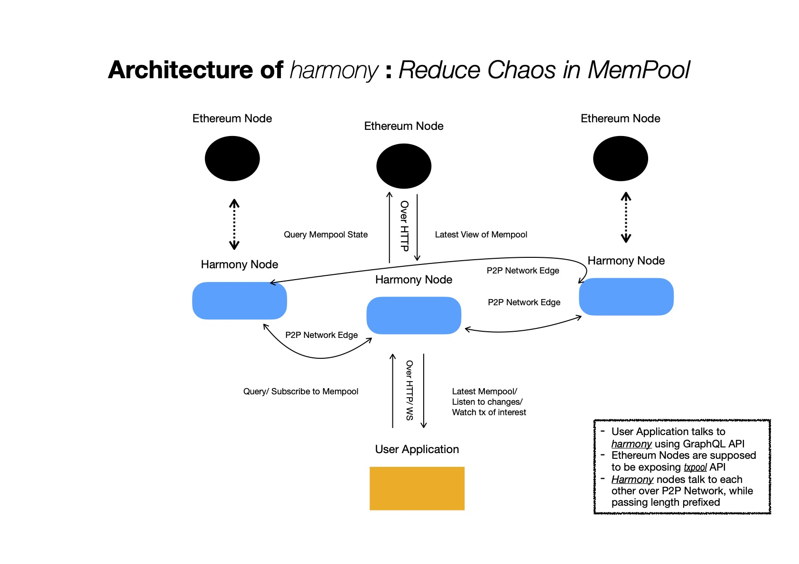
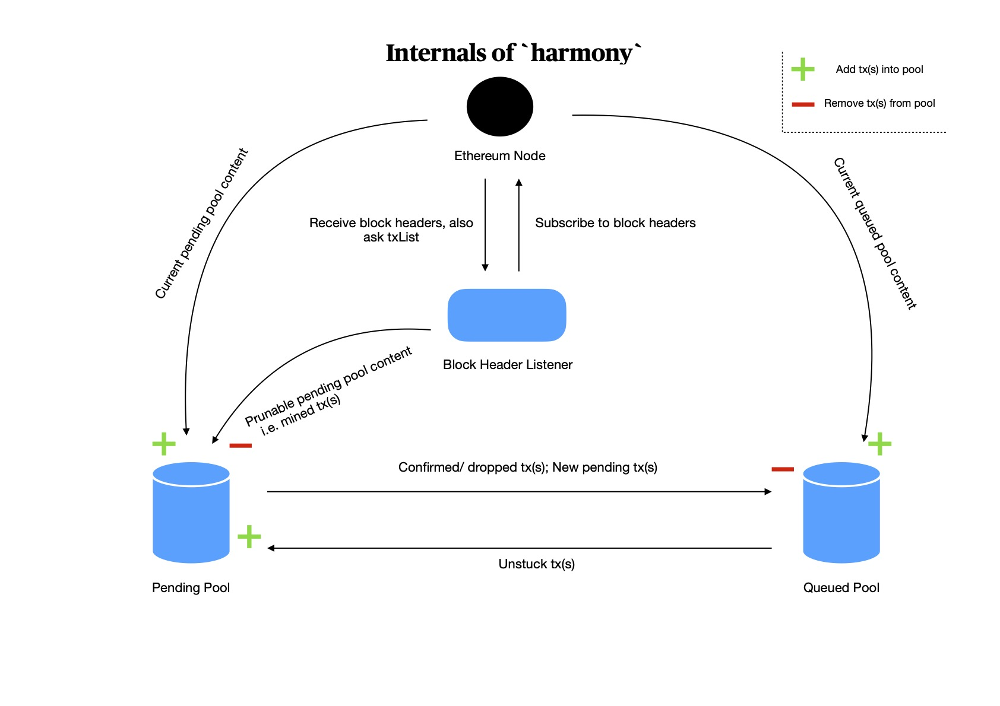
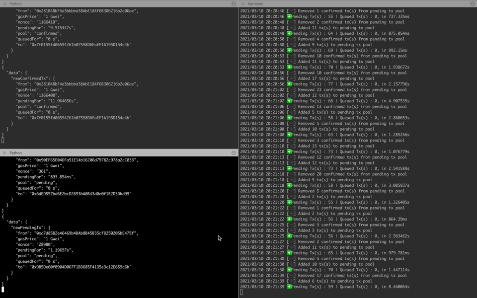

# harmony
Reduce Chaos in MemPool 😌

**Production grade release : >= v0.8.0**


## Table of Contents

- [Why did you write `harmony` ?](#motivation)
- [How is everything organised ?](#architecture)
- [What do I need to have for installing `harmony` ?](#prerequisite)
- [How do I get `harmony` up & running ?](#installation)
- [How do I interact with `harmony` ?](#usage)
	- [Checking overall status of mempool](#status-of-memPool)
	- [Inspecting Mempool](#mempool)
		- [Catching Any Tx leaving/ joining Mempool](#catching-any-mempool-changes)
		- [Catching Tx(s) From `A` in Mempool](#catching-txs-from-a-in-mempool)
		- [Catching Tx(s) To `A` in Mempool](#catching-txs-to-a-in-mempool)
		- [Watching Tx](#watching-tx)
	- [Inspecting tx(s) in pending pool](#pending-pool)
		- [Pending For >= `X`](#pending-for-more-than-X)
		- [Pending For <= `X`](#pending-for-less-than-X)
		- [Pending With >= `X` ( Gwei )](#pending-with-more-than-X)
		- [Pending With <= `X` ( Gwei )](#pending-with-less-than-X)
		- [Pending From Address `A`](#pending-from-A)
		- [Pending To Address `A`](#pending-to-A)
		- [Top `X` Pending Tx(s)](#top-X-pending)
		- [Pending Duplicate Tx(s)](#pending-duplicate-txs)
		- [New Pending Tx(s)](#new-pending-txs) **[ WebSocket ]**
		- [New Confirmed Tx(s)](#new-confirmed-txs) **[ WebSocket ]**
		- [Catch All Pending Pool Changes](#pending-pool-changes) **[ WebSocket ]**
		- [New Pending Tx(s) From Address `A`](#new-pending-txs-from) **[ WebSocket ]**
		- [New Confirmed Tx(s) From Address `A`](#new-confirmed-txs-from) **[ WebSocket ]**
		- [Catching new pending tx from `A`](#catching-new-pending-tx-from-a) **[ WebSocket ]**
		- [New Pending Tx(s) To Address `A`](#new-pending-txs-to) **[ WebSocket ]**
		- [New Confirmed Tx(s) To Address `A`](#new-confirmed-txs-to) **[ WebSocket ]**
		- [Catching new pending tx to `A`](#catching-new-pending-tx-to-a) **[ WebSocket ]**
	- [Inspecting tx(s) in queued pool](#queued-pool)
		- [Queued For >= `X`](#queued-for-more-than-X)
		- [Queued For <= `X`](#queued-for-less-than-X)
		- [Queued With >= `X` ( Gwei )](#queued-with-more-than-X)
		- [Queued With <= `X` ( Gwei )](#queued-with-less-than-X)
		- [Queued From Address `A`](#queued-from-A)
		- [Queued To Address `A`](#queued-to-A)
		- [Top `X` Queued Tx(s)](#top-X-queued)
		- [Queued Duplicate Tx(s)](#queued-duplicate-txs)
		- [New Queued Tx(s)](#new-queued-txs) **[ WebSocket ]**
		- [New Unstuck Tx(s)](#new-unstuck-txs) **[ WebSocket ]**
		- [Catch All Queued Pool Changes](#queued-pool-changes) **[ WebSocket ]**
		- [New Queued Tx(s) From Address `A`](#new-queued-txs-from) **[ WebSocket ]**
		- [New Unstuck Tx(s) From Address `A`](#new-unstuck-txs-from) **[ WebSocket ]**
		- [Catching new queued tx from `A`](#catching-new-queued-tx-from-a) **[ WebSocket ]**
		- [New Queued Tx(s) To Address `A`](#new-queued-txs-to) **[ WebSocket ]**
		- [New Unstuck Tx(s) To Address `A`](#new-unstuck-txs-to) **[ WebSocket ]**
		- [Catching new queued tx to `A`](#catching-new-queued-tx-to-a) **[ WebSocket ]**
- [Any easy to use test ground for API ?](#graphQL-playground)
- [Do you have any example(s), showing programmatically querying/ subscribing to GraphQL API ?](#graphQL-query-subscription-examples)

## Motivation

I discovered **Ethereum's MemPool is one of the least explored domains, but not really least important**. 

Whenever a block is mined & some tx(s) are included in it, it's pretty much, _value living at rest_, whereas is case of mempool, _value is in-flight_. A lot of tx(s) are fighting for their space in next block to be mined, where only a few will get their place. But who will get, based or what criteria, it's not very much well defined.

We generally believe giving higher gas price compared to other tx(s) currently present in mempool, gives better chance that block miner will pick this tx during next block mining. But block miner always gets to override that, using custom logic. Also any one can write an automated program for monitoring mempool and replicate tx(s) of their interest with their own address, higher gas price - which may help them in cutting deal faster than original one or benefitting if target smart contract has some security loophole.

During my journey of exploring Ethereum MemPool, I found good initiative from [BlockNative](https://www.blocknative.com) in demystifying MemPool. They've built some interesting products on top of mempool.

`harmony - Reduce Chaos in MemPool 😌`, aims to become a reliable mempool monitoring engine, while exposing useful functionalities for letting client applications write their monitoring logic seamlessly, with out worrying about underlying details too much 😎

- You can subscribe to listen for tx(s) going to/ from address of interest
- You can catch duplicate nonce tx(s), which of them gets accepted/ dropped
- You can build notification service on top of it
- It will help you in getting better gas price prediction
- It can be used for building real-time charts showing current network traffic
- Many more ...

## Architecture





## Prerequisite

- Make sure you've _`Go ( >= 1.16)`_, _`make`_ installed
- Get one Ethereum Node up & running, with `txpool` RPC API enabled. You can always use SaaS Ethereum node.
- For leveraging pub/sub functionality `harmony` expects to get access to `0hub` - a Pub/Sub Hub, which can be deployed by following [this](https://github.com/itzmeanjan/pub0sub#hub) guide

> Note: You'll need to fill `0hub`'s host, port in .env file

## Installation

- For using `harmony`, let's first clone this repo

```bash
git clone https://github.com/itzmeanjan/harmony.git
```

- After getting inside `harmony`, create `.env` file with 👇 content

```bash
cd harmony
touch .env
```

```bash
RPCUrl=https://<rpc-node>
WSUrl=wss://<rpc-node>
MemPoolPollingPeriod=1000
PendingPoolSize=4096
QueuedPoolSize=4096
PendingTxEntryTopic=pending_pool_entry
PendingTxExitTopic=pending_pool_exit
QueuedTxEntryTopic=queued_pool_entry
QueuedTxExitTopic=queued_pool_exit
ConcurrencyFactor=10
Port=7000
Pub0SubHost=127.0.0.1
Pub0SubPort=13000
```

Environment Variable | Interpretation
--- | ---
RPCUrl | `txpool` RPC API enabled Ethereum Node's URI
WSUrl | To be used for listening to newly mined block headers
MemPoolPollingPeriod | RPC node's mempool to be checked every `X` milliseconds
PendingPoolSize | #-of pending tx(s) to be kept in-memory at a time
QueuedPoolSize | #-of queued tx(s) to be kept in-memory at a time
PendingTxEntryTopic | Whenever tx enters pending pool, it'll be published on Pub/Sub topic `t`
PendingTxExitTopic | Whenever tx leaves pending pool, it'll be published on Pub/Sub topic `t`
QueuedTxEntryTopic | Whenever tx enters queued pool, it'll be published on Pub/Sub topic `t`
QueuedTxExitTopic | Whenever tx leaves queued pool, it'll be published on Pub/Sub topic `t`
ConcurrencyFactor | Whenever concurrency can be leveraged, `harmony` will create worker pool with `#-of logical CPUs x ConcurrencyFactor` go routines. **[ Can be float too ]**
Port | Starts HTTP server on this port ( > 1024 )
Pub0SubHost | Pub/Sub Hub i.e. `0hub` listening on address
Pub0SubPort | Pub/Sub Hub i.e. `0hub` listening on port

> Note : When pool size exceeds, tx with lowest gas price paid to be dropped. Consider setting pool sizes to higher values, if you've enough memory on machine, otherwise it'll crash.

---

### Multi-Node Cluster Setup

- If you're willing to form of cluster of `harmony` nodes, so that they get a better picture of mempool, where each `harmony` node is assumed to be connected to different Ethereum Node, you need to add following options in your `.env` file.

> Note : If mono-mode is preferred, you can simply ignore this section.

```bash
NetworkingEnabled=true
NetworkingDiscoveryMode=2
NetworkingRendezvous=this-is-rendezvous
NetworkingPort=7001
NetworkingStream=this-is-stream
NetworkingBootstrap=
```

As `harmony` nodes will form a P2P mesh network, you need to **first** switch networking on, by setting `NetworkingEnabled` to `true` ( default value is `false` ).

> If you explicitly set this field to `false`, all `Networking*` fields to be ignored.

Each `harmony` node can help others to discover peers so that they can easily form a large P2P mesh network, which can be enabled by setting `NetworkingDiscoveryMode` to `2`. This field accepts either of {1, 2}, where

- 1 => Client Mode : _Don't help others in discoverying their peers_  [ **Default** ]
- 2 => Server Mode : _Do 👆_

`harmony` nodes attempt to discover other peers of interest, by publishing a `rendezvous` string on P2P network & look for new peers who are publishing same `rendezvous` string. That need to be set using `NetworkingRendezvous`. Make sure all nodes of your cluster uses same rendezvous string.

`harmony` nodes need to talk to each other over TCP, the port they use can be very different for each node. You can always set it with `NetworkingPort`.

> `harmony` will only listen on loopback address i.e. 127.0.0.1

After your `harmony` instances have discovered each other, they'll start sending some meaningful data to each other & for doing so, a pair of nodes will open a bidirectional stream between them. This stream name can be customised using `NetworkingStream`.

> Make sure all nodes of your cluster attempt to contract others using same stream.

During setting up a multi-node cluster, you first start a node where `NetworkingBootstrap` is kept empty, so that it'll attempt to use **IPFS** provided default bootstrap nodes, for discovering peers. Then for other nodes, you can just specify any already running `harmony` node's multiaddress, _you'll see on console log when it boots up_, as bootstrap node address. But make sure that node has `NetworkingDiscoveryMode` set to **2** i.e. Server Mode.

> Your node's unique multi address will like : `/ip4/127.0.0.1/tcp/7001/p2p/QmP9mDwJ3wLhQ8DzxJ5jApyEEtsjAeSoQ7ER1T6srgredW`

This way you can keep adding `N`-many nodes to your cluster.

⭐️ One thing to notice, the whole purpose of multinode cluster set up is to gain much larger view of mempool, because mempool is very node specific thing, which will be satisfied if your `harmony` instances are connected to different Ethereum Nodes, who has `txpool` API enabled. 

✅ **This is recommended practice, but you can always test multi-node set up, while relying on same Ethereum Node. In that case your interest can be putting all these `harmony` instances behind load balancer & serving client requests in better fashion & it's perfectly okay.**

---

- Let's build & run `harmony`

```bash
make run
```

## Usage

### Status of MemPool

For checking current state of mempool, you can issue one HTTP GET request

Method : **GET**

URL : **/v1/stat**


```bash
curl -s localhost:7000/v1/stat | jq
```

You'll receive response like 👇

```json
{
  "pendingPoolSize": 257530,
  "queuedPoolSize": 55278,
  "uptime": "271h54m7.240520958s",
  "processed": 15808071,
  "latestBlock": 12359655,
  "latestSeenAgo": "8.46197605s",
  "networkID": 1
}
```

Field | Interpretation
--- | ---
pendingPoolSize | Currently these many tx(s) are in pending state i.e. waiting to be picked up by some miner when next block gets mined
queuedPoolSize | These tx(s) are stuck, will only be eligible for mining when lower nonce tx(s) of same wallet joins pending pool
uptime | This mempool monitoring engine is alive for last `t` time unit
processed | Mempool has seen `N` tx(s) getting confirmed/ dropped i.e. permanently leaving pool
latestBlock | Last block, mempool heard of, from RPC Node
lastestSeenAgo | Last block was seen `t` time unit ago
networkID | The mempool monitoring engine keeps track of mempool of this network

### Mempool

Querying/ watching Mempool changes. 

> Note : Watching mempool is equivalent of watching pending & queued pools together.

### Catching Any Mempool Changes

Whenever any change in mempool pool happens i.e. tx joins/ leaves pending/ queued pool, subscriber will be notified of those.

- Tx joins queued pool, when it's stuck due to some nonce gap
- It'll leave queued pool, when it's unstuck & lower nonce tx is processed
- Tx joins pending pool, when it's ready to be included in next block [ **though might not** ]
- Tx leaves pool, when tx it has been included in just mined block

Aforementioned changes generally happen in mempool & using following subscription API lets you capture all of those.

Transport : **WebSocket**

URL : **/v1/graphql**

```graphql
subscription {
  memPool{
    from
    to
    gasPrice
	pool
	pendingFor
	queuedFor
  }
}
```

### Catching Tx(s) From `A` in Mempool

When some new tx joins either of queued/ pending pool & that tx is sent from address `A`, subscriber to be notified of it.

When that tx will leave pool, client to be notified.

Transport : **WebSocket**

URL : **/v1/graphql**

```graphql
subscription {
  newTxFromAInMemPool{
    from
    to
    gasPrice
	pool
	pendingFor
	queuedFor
  }
}
```

### Catching Tx(s) To `A` in Mempool

When some new tx joins either of queued/ pending pool & that tx is sent to address `A`, subscriber to be notified of it.

When that tx will leave pool, client to be notified.

> Contract creation tx(s) will have empty `to` field

Transport : **WebSocket**

URL : **/v1/graphql**

```graphql
subscription {
  newTxToAInMemPool{
    from
    to
    gasPrice
	pool
	pendingFor
	queuedFor
  }
}
```

### Watching Tx

You can watch any submitted pending/ queued tx, by using this API. Only requirement is tx must be currently living in mempool.

You can submit a tx on your chain of interest & invoke this API for listening to state changes concerned with this tx. You can pump this tx up, by increasing gas fees, which will result in different tx with same nonce getting submitted. And after sometime, when higher gas price tx gets accepted & lower one gets dropped, you'll get notified for both.

This can be useful, when your users use different walletUI, other than that you provide with, for pumping tx up, with higher gas price, you'll keep watching tx, until one tx with that nonce gets accepted.

Transport : **WebSocket**

URL : **/v1/graphql**

```graphql
subscription {
	watchTx(hash: "0x905c056e4e7818d0b857941edc627277cc4c772847fec1708134fb366439110c") {
    	from
    	to
    	nonce
    	gas
    	gasPrice
    	queuedFor
    	pendingFor
    	pool
	}
}
```

> Note: As of now, after watching is done, unsubscription is client's responsibility.

### Pending Pool

Pending pool inspection related APIs.

### Pending for more than `X`

For listing all tx(s) pending for more than or equals to `x` time unit, send graphQL query

Method : **POST**

URL : **/v1/graphql**


```graphql
query {
  pendingForMoreThan(x: "10s") {
    from
  	gas
  	gasPrice
  	hash
  	input
  	nonce
  	to
  	value
  	v
  	r
  	s
  	pendingFor
  	queuedFor
  	pool
  }
}
```

You'll receive response of form

```json
{
  "data": {
    "pendingForMoreThan": [
      {
        "from": "0xdF0692E287A763e5c011cc96Ee402994c6Dd246E",
        "gas": "35743",
        "gasPrice": "74 Gwei",
        "hash": "0x142f95b4615ad31d5435fb979a07405d50b70a2dab2707001cdb04853b75537e",
        "input": "0x22c67519000000000000000000000000000000000000000000000000000000000000002000000000000000000000000000000000000000000000000000000000000000010000000000000000000000000000000000000000000000000000000000001e35",
        "nonce": "108",
        "to": "0x86935F11C86623deC8a25696E1C19a8659CbF95d",
        "value": "0x0",
        "v": "0x136",
        "r": "0x4becd37941425526e5a1d361a44fd5f911affacaa5526e42e7a20c4a9fb04f90",
        "s": "0x3052c55bf6ac67326b4adb92c9ff3288ffe0f0be829b726c2a1cf5b9a58dca5c",
        "pendingFor": "10.677797s",
        "queuedFor": "0 s",
        "pool": "pending"
      }
    ]
  }
}
```

---

### Pending for less than `X`

For listing all tx(s) pending for less than or equals to `x` time unit, send graphQL query

Method : **POST**

URL : **/v1/graphql**


```graphql
query {
  pendingForLessThan(x: "1m10s") {
    from
  	gas
  	gasPrice
  	hash
  	input
  	nonce
  	to
  	value
  	v
  	r
  	s
  	pendingFor
  	queuedFor
  	pool
  }
}
```

---

### Pending with more than `X`

For listing all tx(s) pending with gas price >= `x` GWei, send graphQL query

Method : **POST**

URL : **/v1/graphql**


```graphql
query {
  pendingWithMoreThan(x: 20.1) {
	from
	hash
	gasPriceGwei
  }
}
```

---

### Pending with less than `X`

For listing all tx(s) pending with gas price <= `x` GWei, send graphQL query

Method : **POST**

URL : **/v1/graphql**


```graphql
query {
  pendingWithLessThan(x: 10.1) {
	from
	hash
	gasPriceGwei
  }
}
```

---

### Pending from `A`

For getting a list of all pending tx(s) `from` specific address, send a graphQL query like 👇

> Note : More than one pending tx from same address, denotes those are same nonce tx(s).

Method : **POST**

URL : **/v1/graphql**

```graphql
query {
  pendingFrom(addr: "0x63ec5767F54F6943750A70eB6117EA2D9Ca77313") {
    from
  	gas
  	gasPrice
  	hash
  	input
  	nonce
  	to
  	value
  	v
  	r
  	s
  	pendingFor
  	queuedFor
  	pool
  }
}
```

---

### Pending to `A`

For getting a list of all pending tx(s) sent `to` specific address, you can send a graphQL query like 👇

Method : **POST**

URL : **/v1/graphql**

```graphql
query {
  pendingTo(addr: "0x63ec5767F54F6943750A70eB6117EA2D9Ca77313") {
    from
  	gas
  	gasPrice
  	hash
  	input
  	nonce
  	to
  	value
  	v
  	r
  	s
  	pendingFor
  	queuedFor
  	pool
  }
}
```

---

### Top `X` pending

Top **X** pending transaction(s), with high gas price

Method : **POST**

URL : **/v1/graphql**

```graphql
query {
  topXPendingWithHighGasPrice(x: 10) {
    from
  	gas
  	gasPrice
  	hash
  	input
  	nonce
  	to
  	value
  	v
  	r
  	s
  	pendingFor
  	queuedFor
  	pool
  }
}
```

---

Top **X** pending transaction(s), with low gas price

Method : **POST**

URL : **/v1/graphql**

```graphql
query {
  topXPendingWithLowGasPrice(x: 10) {
    from
  	gas
  	gasPrice
  	hash
  	input
  	nonce
  	to
  	value
  	v
  	r
  	s
  	pendingFor
  	queuedFor
  	pool
  }
}
```

---

### Pending Duplicate Tx(s)

Given txHash, attempts to find out duplicate tx(s) present in pending pool.

> Tx is considered to be duplicate, when it has, same sender address & nonce

Method : **POST**

URL : **/v1/graphql**

```graphql
query {
  pendingDuplicates(hash: "0x2d17f2941e33afd3a648e3257857ed032191b7b93911364ba4906d640ca69b49") {
    from
	to
  	gas
  	gasPrice
  	hash
  	nonce
  	pendingFor
  	queuedFor
  	pool
  }
}
```

---

### New pending tx(s)

Listening for any new tx, being added to pending pool, in real-time, over websocket transport


Transport : **WebSocket**

URL : **/v1/graphql**

```graphql
subscription {
  newPendingTx{
    from
    to
    gas
    gasPrice
    nonce
  }
}
```

---

### New confirmed tx(s)

Listening for any new tx, leaving pending pool i.e. **confirmed**, in real-time, over websocket transport

Transport : **WebSocket**

URL : **/v1/graphql**

```graphql
subscription {
  newConfirmedTx{
    from
    to
    gasPrice
  }
}
```

---

### Pending Pool Changes

Whenever any change in pending tx pool happens i.e. tx joins/ leaves pool, subscriber will be notified of those

- Tx joins pending pool, when it's ready to be included in next block [ **though might not** ]
- Tx leaves pool, when tx it has been included in just mined block

Transport : **WebSocket**

URL : **/v1/graphql**

```graphql
subscription {
  pendingPool{
    from
    to
    gasPrice
	pool
  }
}
```

---

### New pending tx(s) `from`

When ever any tx is detected to be entering pending pool, where `from` address is matching with specified one, subscriber will be notified of it.

Transport : **WebSocket**

URL : **/v1/graphql**

```graphql
subscription {
  newPendingTxFrom(address: "0x63ec5767F54F6943750A70eB6117EA2D9Ca77313"){
    from
    to
    gasPrice
  }
}
```

---

### New confirmed tx(s) `from`

When ever any tx is detected to be leaving pending pool i.e. _got included in some block_, where `from` address is matching with specified one, subscriber will be notified of it.

Transport : **WebSocket**

URL : **/v1/graphql**

```graphql
subscription {
  newConfirmedTxFrom(address: "0x63ec5767F54F6943750A70eB6117EA2D9Ca77313"){
    from
    to
    gasPrice
  }
}
```

---

### Catching new pending tx from `A`

When new tx, sent from address `A`, is detected to be entering pending pool, client to be notified. Also when tx will be confirmed, they will be notified, that tx has left pending pool.

Transport : **WebSocket**

URL : **/v1/graphql**

```graphql
subscription {
  newTxFromAInPendingPool(address: "0x63ec5767F54F6943750A70eB6117EA2D9Ca77313"){
    from
    to
    gasPrice
	pendingFor
	queuedFor
  }
}
```

---

### New pending tx(s) `to`

When ever any tx is detected to be entering pending pool, where `to` address is matching with specified one, subscriber will be notified of it.

> Note: Tx(s) attempting to deploy contract, will have no `to` address

Transport : **WebSocket**

URL : **/v1/graphql**

```graphql
subscription {
  newPendingTxTo(address: "0x63ec5767F54F6943750A70eB6117EA2D9Ca77313"){
    from
    to
    gasPrice
  }
}
```

---

### New confirmed tx(s) `to`

When ever any tx is detected to be leaving pending pool i.e. _got included in some block_, where `to` address is matching with specified one, subscriber will be notified of it.

Transport : **WebSocket**

URL : **/v1/graphql**

```graphql
subscription {
  newConfirmedTxTo(address: "0x63ec5767F54F6943750A70eB6117EA2D9Ca77313"){
    from
    to
    gasPrice
  }
}
```

---

### Catching new pending tx to `A`

When new tx, where recipient address is `A`, is detected to be entering pending pool, client to be notified. Also when tx will be confirmed, they will be notified, that tx has left pending pool.

Transport : **WebSocket**

URL : **/v1/graphql**

```graphql
subscription {
  newTxToAInPendingPool(address: "0x63ec5767F54F6943750A70eB6117EA2D9Ca77313"){
    from
    to
    gasPrice
	pendingFor
	queuedFor
  }
}
```

### Queued Pool

Queued tx pool inspection APIs.

### Queued for more than `X`

For listing all tx(s) queued for more than or equals to `x` time unit, send graphQL query

Method : **POST**

URL : **/v1/graphql**


```graphql
query {
  queuedForMoreThan(x: "1h10m39s") {
    from
  	gas
  	gasPrice
  	hash
  	input
  	nonce
  	to
  	value
  	v
  	r
  	s
  	pendingFor
  	queuedFor
  	pool
  }
}
```

---

### Queued for less than `X`

For listing all tx(s) queued for less than or equals to `x` time unit, send graphQL query

Method : **POST**

URL : **/v1/graphql**


```graphql
query {
  queuedForLessThan(x: "1m10s100ms") {
    from
  	gas
  	gasPrice
  	hash
  	input
  	nonce
  	to
  	value
  	v
  	r
  	s
  	pendingFor
  	queuedFor
  	pool
  }
}
```

---

### Queued with more than `X`

For listing all tx(s) queued with gas price >= `x` GWei, send graphQL query

Method : **POST**

URL : **/v1/graphql**


```graphql
query {
  queuedWithMoreThan(x: 20.1) {
	from
	hash
	gasPriceGwei
  }
}
```

---

### Queued with less than `X`

For listing all tx(s) queued with gas price <= `x` GWei, send graphQL query

Method : **POST**

URL : **/v1/graphql**


```graphql
query {
  queuedWithLessThan(x: 10.1) {
	from
	hash
	gasPriceGwei
  }
}
```

---

### Queued from `A`

For getting a list of all queued tx(s) `from` specific address, send a graphQL query like 👇

> Note : These are present in queued pool due to nonce gap in sender's address i.e. there must be some tx with lower nonce present in pending pool & until that one gets mined, these tx(s) in queued pool, will not move into pending pool.

Method : **POST**

URL : **/v1/graphql**

```graphql
query {
  queuedFrom(addr: "0x63ec5767F54F6943750A70eB6117EA2D9Ca77313") {
    from
  	gas
  	gasPrice
  	hash
  	input
  	nonce
  	to
  	value
  	v
  	r
  	s
  	pendingFor
  	queuedFor
  	pool
  }
}
```

---

### Queued to `A`

For getting a list of all queued tx(s) sent `to` specific address, you can send a graphQL query like 👇

Method : **POST**

URL : **/v1/graphql**

```graphql
query {
  queuedTo(addr: "0x63ec5767F54F6943750A70eB6117EA2D9Ca77313") {
    from
  	gas
  	gasPrice
  	hash
  	input
  	nonce
  	to
  	value
  	v
  	r
  	s
  	pendingFor
  	queuedFor
  	pool
  }
}
```

---

### Top `X` pending

Top **X** queued transaction(s), with high gas price

Method : **POST**

URL : **/v1/graphql**

```graphql
query {
  topXQueuedWithHighGasPrice(x: 10) {
    from
  	gas
  	gasPrice
  	hash
  	input
  	nonce
  	to
  	value
  	v
  	r
  	s
  	pendingFor
  	queuedFor
  	pool
  }
}
```

---

Top **X** queued transaction(s), with low gas price

Method : **POST**

URL : **/v1/graphql**

```graphql
query {
  topXQueuedWithLowGasPrice(x: 10) {
    from
  	gas
  	gasPrice
  	hash
  	input
  	nonce
  	to
  	value
  	v
  	r
  	s
  	pendingFor
  	queuedFor
  	pool
  }
}
```

---

### Queued Duplicate Tx(s)

Given txHash, attempts to find out duplicate tx(s) present in queued pool.

> Tx is considered to be duplicate, when it has, same sender address & nonce

Method : **POST**

URL : **/v1/graphql**

```graphql
query {
  queuedDuplicates(hash: "0x2d17f2941e33afd3a648e3257857ed032191b7b93911364ba4906d640ca69b49") {
    from
	to
  	gas
  	gasPrice
  	hash
  	nonce
  	pendingFor
  	queuedFor
  	pool
  }
}
```

---

### New queued tx(s)

Listening for any new tx, being added to queued pool, in real-time, over websocket transport

Transport : **WebSocket**

URL : **/v1/graphql**

```graphql
subscription {
  newQueuedTx{
    from
    to
    gas
    gasPrice
    nonce
  }
}
```

---

### New unstuck tx(s)

Listening for any new tx, leaving queued tx pool i.e. **unstuck**, in real-time, over websocket transport

Transport : **WebSocket**

URL : **/v1/graphql**

```graphql
subscription {
  newUnstuckTx{
    from
    to
    gasPrice
  }
}
```

---

### Queued Pool Changes

Whenever any change in queued tx pool happens i.e. tx joins/ leaves pool, subscriber will be notified of those

- Tx joins queued pool, due to some issue in sender's account [ **mostly nonce gap** ], because it's not eligible for inclusion in next block to be mined
- Tx leaves pool, when lower nonce has been filled up & this stuck tx is now ready to get included in block [ **It's unstuck now** ]

Transport : **WebSocket**

URL : **/v1/graphql**

```graphql
subscription {
  queuedPool{
    from
    to
    gasPrice
	pool
  }
}
```

---

### New queued tx(s) `from`

When ever any tx is detected to be entering queued pool _( because they're stuck due to nonce gap )_, where `from` address is matching with specified one, subscriber will be notified of it.

Transport : **WebSocket**

URL : **/v1/graphql**

```graphql
subscription {
  newQueuedTxFrom(address: "0x63ec5767F54F6943750A70eB6117EA2D9Ca77313"){
    from
    to
    gasPrice
  }
}
```

---

### New unstuck tx(s) `from`

When ever any tx is detected to be leaving queued pool _( because they were stuck due to nonce gap )_, where `from` address is matching with specified one, subscriber will be notified of it.

Transport : **WebSocket**

URL : **/v1/graphql**

```graphql
subscription {
  newUnstuckTxFrom(address: "0x63ec5767F54F6943750A70eB6117EA2D9Ca77313"){
    from
    to
    gasPrice
  }
}
```

---

### Catching new queued tx from `A`

When new tx, from address `A`, is detected to be entering queued pool, client to be notified. Also when that tx will be unstuck, client will be notified, that tx has left queued pool & it's now eligible to enter pending pool & become candidate tx for next block to be mined.

Transport : **WebSocket**

URL : **/v1/graphql**

```graphql
subscription {
  newTxFromAInQueuedPool(address: "0x63ec5767F54F6943750A70eB6117EA2D9Ca77313"){
    from
    to
    gasPrice
	pendingFor
	queuedFor
  }
}
```

---

### New queued tx(s) `to`

When ever any tx is detected to be entering queued pool _( because they're stuck due to nonce gap )_, where `to` address is matching with specified one, subscriber will be notified of it.

Transport : **WebSocket**

URL : **/v1/graphql**

```graphql
subscription {
  newQueuedTxTo(address: "0x63ec5767F54F6943750A70eB6117EA2D9Ca77313"){
    from
    to
    gasPrice
  }
}
```

---

### New unstuck tx(s) `to`

When ever any tx is detected to be leaving queued pool _( because they were stuck due to nonce gap )_, where `to` address is matching with specified one, subscriber will be notified of it.

Transport : **WebSocket**

URL : **/v1/graphql**

```graphql
subscription {
  newUnstuckTxTo(address: "0x63ec5767F54F6943750A70eB6117EA2D9Ca77313"){
    from
    to
    gasPrice
  }
}
```

---

### Catching new queued tx to `A`

When new tx, targeted to address `A`, is detected to be entering queued pool, client to be notified. Also when tx will be unstuck, they will be notified, that tx has left queued pool & it's now eligible to enter pending pool & become candidate tx for next block to be mined.

Transport : **WebSocket**

URL : **/v1/graphql**

```graphql
subscription {
  newTxToAInQueuedPool(address: "0x63ec5767F54F6943750A70eB6117EA2D9Ca77313"){
    from
    to
    gasPrice
	pendingFor
	queuedFor
  }
}
```

## GraphQL Playground

`harmony` packs one graphQL playground for you, where you can play around with both `query` & `subscription` methods.

> `query` works over HTTP transport, where as `subscription` works only over Websocket transport.


URI : `https://<base-url>/v1/graphql-playground`

## GraphQL Query/ Subscription Examples

I've written some examples for programmatically querying GraphQL API over HTTP & subscribing to topics for listening to MemPool state changes in real-time, over Websocket transport.



You can find those [here](./examples). Before you run those

- Make sure you've Python3 installed. They're tested to be working on `Python 3.9.2`
- Let's first enable virtual environment, by doing

```bash
cd examples
python3 -m venv venv
source venv/bin/activate
```

- We can now fetch dependencies, by doing

```bash
pip install -r requirements.txt
```

- You can now run any of examples, by doing


```bash
python3 query.py
python3 subscribe_1.py
```

> Make sure, you've access to `harmony` node.

- Finally when you're done, you can get out of virtual environment


```bash
deactivate
```
