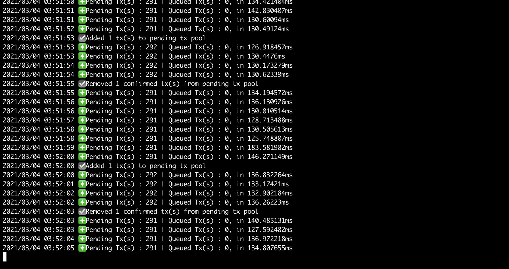
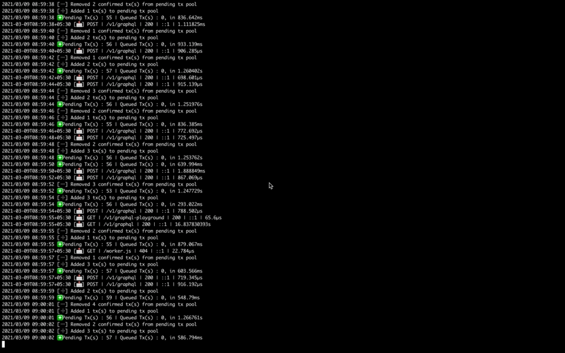
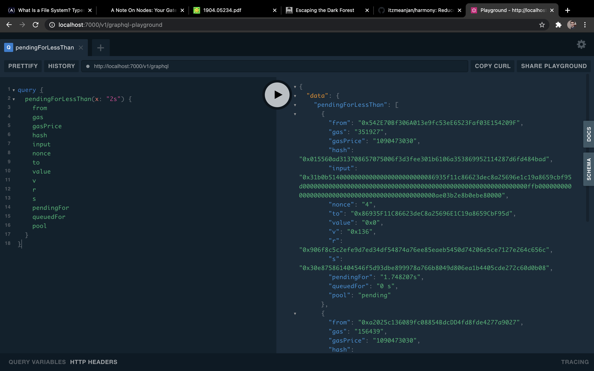

# harmony
Reduce Chaos in MemPool 😌



## Table of Contents

- [Why did you write `harmony` ?](#motivation)
- [What do I need to have for installing `harmony` ?](#prerequisite)
- [How do I get `harmony` up & running ?](#installation)
- [How do I interact with `harmony` ?](#usage)
	- [Checking overall status of mempool](#status-of-memPool)
	- [Inspecting tx(s) in pending pool](#pending-pool)
		- [Pending For >= `X`](#pending-for-more-than-X)
		- [Pending For <= `X`](#pending-for-less-than-X)
		- [Pending From Address `A`](#pending-from-A)
		- [Pending To Address `A`](#pending-to-A)
		- [Top `X` Pending Tx(s)](#top-X-pending)
		- [New Pending Tx(s)](#new-pending-txs) **[ WebSocket ]**
		- [New Confirmed Tx(s)](#new-confirmed-txs) **[ WebSocket ]**
	- [Inspecting tx(s) in queued pool](#queued-pool)
		- [Queued For >= `X`](#queued-for-more-than-X)
		- [Queued For <= `X`](#queued-for-less-than-X)
		- [Queued From Address `A`](#queued-from-A)
		- [Queued To Address `A`](#queued-to-A)
		- [Top `X` Queued Tx(s)](#top-X-queued)
		- [New Queued Tx(s)](#new-queued-txs) **[ WebSocket ]**
		- [New Unstuck Tx(s)](#new-unstuck-txs) **[ WebSocket ]**
- [Any easy to use test ground for API ?](#graphQL-playground)

## Motivation

I discovered **Ethereum's MemPool is one of the least explored domains, but not really least important**. 

Whenever a block is mined & some tx(s) are included in it, it's pretty much, _value living at rest_, whereas is case of mempool, _value is in-flight_. A lot of tx(s) are fighting for their space in next block to be mined, where only a few will get their place. But who will get, based or what criteria, it's not very much well defined.

We generally believe giving higher gas price compared to other tx(s) currently present in mempool, gives better chance that block miner will pick this tx during next block mining. But block miner always gets to override that, using custom logic. Also any one can write an automated program for monitoring mempool and replicate tx(s) of their interest with their own address, higher gas price - which may help them in cutting deal faster than original one or benefitting if target smart contract has some security loophole.

During my journey of exploring Ethereum MemPool, I found good initiative from [BlockNative](https://www.blocknative.com) in demystifying MemPool. They've built some interesting products on top of mempool.

`harmony - Reduce Chaos in MemPool 😌`, aims to become a reliable mempool monitoring engine, while exposing useful functionalities for letting client applications write their monitoring logic seamlessly, with out worrying about underlying details too much 😎

- You can subscribe to listen for tx(s) going to/ from address of interest
- You can catch duplicate nonce tx(s), which of them gets accepted/ dropped
- You can build notification service on top of it
- It will help you in getting better gas price prediction
- It can be used for building real-time charts showing current network traffic
- Many more ...

## Prerequisite

- Make sure you've _`Go ( >= 1.16)`_, _`make`_ installed
- You need to also have _`Redis ( >= 5.x )`_

> Note : Consider setting up Redis instance with password protection

- Get one Ethereum Node up & running, with `txpool` RPC API enabled. You can always use SaaS Ethereum node.

## Installation

- For using `harmony`, let's first clone this repo

```bash
git clone https://github.com/itzmeanjan/harmony.git
```

- After getting inside `harmony`, create `.env` file with 👇 content

```bash
cd harmony
touch .env
```

```bash
RPCUrl=https://<rpc-node>
MemPoolPollingPeriod=1000
PendingTxEntryTopic=pending_pool_entry
PendingTxExitTopic=pending_pool_exit
QueuedTxEntryTopic=queued_pool_entry
QueuedTxExitTopic=queued_pool_exit
RedisConnection=tcp
RedisAddress=127.0.0.1:6379
RedisPassword=password
RedisDB=1
ConcurrencyFactor=10
Port=7000
```

Environment Variable | Interpretation
--- | ---
RPCUrl | `txpool` RPC API enabled Ethereum Node's URI
MemPoolPollingPeriod | RPC node's mempool to be checked every `X` milliseconds
PendingTxEntryTopic | Whenever tx enters pending pool, it'll be published on Redis topic `t`
PendingTxExitTopic | Whenever tx leaves pending pool, it'll be published on Redis topic `t`
QueuedTxEntryTopic | Whenever tx enters queued pool, it'll be published on Redis topic `t`
QueuedTxExitTopic | Whenever tx leaves queued pool, it'll be published on Redis topic `t`
RedisConnection | Communicate with Redis over transport protocol
RedisAddress | `address:port` combination of Redis
RedisPassword | Authentication details for talking to Redis. **[ Not mandatory ]**
RedisDB | Redis database to be used. **[ By default there're 16 of them ]**
ConcurrencyFactor | Whenever concurrency can be leveraged, `harmony` will create worker pool with `#-of logical CPUs x ConcurrencyFactor` go routines. **[ Can be float too ]**
Port | Starts HTTP server on this port ( > 1024 )

- Let's build & run `harmony`

```bash
make run
```

## Usage

### Status of MemPool

For checking current state of mempool, you can issue one HTTP GET request

Method : **GET**

URL : **/v1/stat**


```bash
curl -s localhost:7000/v1/stat | jq
```

You'll receive response like 👇

```json
{
  "pendingPoolSize": 67,
  "queuedPoolSize": 0,
  "uptime": "29.214603s",
  "networkID": 137
}
```

Field | Interpretation
--- | ---
pendingPoolSize | Currently these many tx(s) are in pending state i.e. waiting to be picked up by some miner when next block gets mined
queuedPoolSize | These tx(s) are stuck, will only be eligible for mining when lower nonce tx(s) of same wallet gets mined
uptime | This mempool monitoring engine is alive for last `t` time unit
networkID | The mempool monitoring engine keeps track of mempool of this network

### Pending Pool

Pending pool inspection related APIs.

### Pending for more than `X`

For listing all tx(s) pending for more than or equals to `x` time unit, send graphQL query

Method : **POST**

URL : **/v1/graphql**


```graphql
query {
  pendingForMoreThan(x: "10s") {
    from
  	gas
  	gasPrice
  	hash
  	input
  	nonce
  	to
  	value
  	v
  	r
  	s
  	pendingFor
  	queuedFor
  	pool
  }
}
```

You'll receive response of form

```json
{
  "data": {
    "pendingForMoreThan": [
      {
        "from": "0xdF0692E287A763e5c011cc96Ee402994c6Dd246E",
        "gas": "35743",
        "gasPrice": "74 Gwei",
        "hash": "0x142f95b4615ad31d5435fb979a07405d50b70a2dab2707001cdb04853b75537e",
        "input": "0x22c67519000000000000000000000000000000000000000000000000000000000000002000000000000000000000000000000000000000000000000000000000000000010000000000000000000000000000000000000000000000000000000000001e35",
        "nonce": "108",
        "to": "0x86935F11C86623deC8a25696E1C19a8659CbF95d",
        "value": "0x0",
        "v": "0x136",
        "r": "0x4becd37941425526e5a1d361a44fd5f911affacaa5526e42e7a20c4a9fb04f90",
        "s": "0x3052c55bf6ac67326b4adb92c9ff3288ffe0f0be829b726c2a1cf5b9a58dca5c",
        "pendingFor": "10.677797s",
        "queuedFor": "0 s",
        "pool": "pending"
      }
    ]
  }
}
```

---

### Pending for less than `X`

For listing all tx(s) pending for less than or equals to `x` time unit, send graphQL query

Method : **POST**

URL : **/v1/graphql**


```graphql
query {
  pendingForLessThan(x: "1m10s") {
    from
  	gas
  	gasPrice
  	hash
  	input
  	nonce
  	to
  	value
  	v
  	r
  	s
  	pendingFor
  	queuedFor
  	pool
  }
}
```

---

### Pending from `A`

For getting a list of all pending tx(s) `from` specific address, send a graphQL query like 👇

> Note : More than one pending tx from same address, denotes those are same nonce tx(s).

Method : **POST**

URL : **/v1/graphql**

```graphql
query {
  pendingFrom(addr: "0x63ec5767F54F6943750A70eB6117EA2D9Ca77313") {
    from
  	gas
  	gasPrice
  	hash
  	input
  	nonce
  	to
  	value
  	v
  	r
  	s
  	pendingFor
  	queuedFor
  	pool
  }
}
```

---

### Pending to `A`

For getting a list of all pending tx(s) sent `to` specific address, you can send a graphQL query like 👇

Method : **POST**

URL : **/v1/graphql**

```graphql
query {
  pendingTo(addr: "0x63ec5767F54F6943750A70eB6117EA2D9Ca77313") {
    from
  	gas
  	gasPrice
  	hash
  	input
  	nonce
  	to
  	value
  	v
  	r
  	s
  	pendingFor
  	queuedFor
  	pool
  }
}
```

---

### Top `X` pending

Top **X** pending transaction(s), with high gas price

Method : **POST**

URL : **/v1/graphql**

```graphql
query {
  topXPendingWithHighGasPrice(x: 10) {
    from
  	gas
  	gasPrice
  	hash
  	input
  	nonce
  	to
  	value
  	v
  	r
  	s
  	pendingFor
  	queuedFor
  	pool
  }
}
```

---

Top **X** pending transaction(s), with low gas price

Method : **POST**

URL : **/v1/graphql**

```graphql
query {
  topXPendingWithLowGasPrice(x: 10) {
    from
  	gas
  	gasPrice
  	hash
  	input
  	nonce
  	to
  	value
  	v
  	r
  	s
  	pendingFor
  	queuedFor
  	pool
  }
}
```

---

### New pending tx(s)

Listening for any new tx, being added to pending pool, in real-time, over websocket transport



Transport : **WebSocket**

URL : **/v1/graphql**

```graphql
subscription {
  newPendingTx{
    from
    to
    gas
    gasPrice
    nonce
  }
}
```

---

### New confirmed tx(s)

Listening for any new tx, leaving pending pool i.e. **confirmed**, in real-time, over websocket transport

Transport : **WebSocket**

URL : **/v1/graphql**

```graphql
subscription {
  newConfirmedTx{
    from
    to
    gasPrice
  }
}
```

### Queued Pool

Queued tx pool inspection APIs.

### Queued for more than `X`

For listing all tx(s) queued for more than or equals to `x` time unit, send graphQL query

Method : **POST**

URL : **/v1/graphql**


```graphql
query {
  queuedForMoreThan(x: "1h10m39s") {
    from
  	gas
  	gasPrice
  	hash
  	input
  	nonce
  	to
  	value
  	v
  	r
  	s
  	pendingFor
  	queuedFor
  	pool
  }
}
```

---

### Queued for less than `X`

For listing all tx(s) queued for less than or equals to `x` time unit, send graphQL query

Method : **POST**

URL : **/v1/graphql**


```graphql
query {
  queuedForLessThan(x: "1m10s100ms") {
    from
  	gas
  	gasPrice
  	hash
  	input
  	nonce
  	to
  	value
  	v
  	r
  	s
  	pendingFor
  	queuedFor
  	pool
  }
}
```

---

### Queued from `A`

For getting a list of all queued tx(s) `from` specific address, send a graphQL query like 👇

> Note : These are present in queued pool due to nonce gap in sender's address i.e. there must be some tx with lower nonce present in pending pool & until that one gets mined, these tx(s) in queued pool, will not move into pending pool.

Method : **POST**

URL : **/v1/graphql**

```graphql
query {
  queuedFrom(addr: "0x63ec5767F54F6943750A70eB6117EA2D9Ca77313") {
    from
  	gas
  	gasPrice
  	hash
  	input
  	nonce
  	to
  	value
  	v
  	r
  	s
  	pendingFor
  	queuedFor
  	pool
  }
}
```

---

### Queued to `A`

For getting a list of all queued tx(s) sent `to` specific address, you can send a graphQL query like 👇

Method : **POST**

URL : **/v1/graphql**

```graphql
query {
  queuedTo(addr: "0x63ec5767F54F6943750A70eB6117EA2D9Ca77313") {
    from
  	gas
  	gasPrice
  	hash
  	input
  	nonce
  	to
  	value
  	v
  	r
  	s
  	pendingFor
  	queuedFor
  	pool
  }
}
```

---

### Top `X` pending

Top **X** queued transaction(s), with high gas price

Method : **POST**

URL : **/v1/graphql**

```graphql
query {
  topXQueuedWithHighGasPrice(x: 10) {
    from
  	gas
  	gasPrice
  	hash
  	input
  	nonce
  	to
  	value
  	v
  	r
  	s
  	pendingFor
  	queuedFor
  	pool
  }
}
```

---

Top **X** queued transaction(s), with low gas price

Method : **POST**

URL : **/v1/graphql**

```graphql
query {
  topXQueuedWithLowGasPrice(x: 10) {
    from
  	gas
  	gasPrice
  	hash
  	input
  	nonce
  	to
  	value
  	v
  	r
  	s
  	pendingFor
  	queuedFor
  	pool
  }
}
```

---

### New queued tx(s)

Listening for any new tx, being added to queued pool, in real-time, over websocket transport

Transport : **WebSocket**

URL : **/v1/graphql**

```graphql
subscription {
  newQueuedTx{
    from
    to
    gas
    gasPrice
    nonce
  }
}
```

---

### New unstuck tx(s)

Listening for any new tx, leaving queued tx pool i.e. **unstuck**, in real-time, over websocket transport

Transport : **WebSocket**

URL : **/v1/graphql**

```graphql
subscription {
  newUnstuckTx{
    from
    to
    gasPrice
  }
}
```

## GraphQL Playground

`harmony` packs one graphQL playground for you, where you can play around with both `query` & `subscription` methods.

> `query` works over HTTP transport, where as `subscription` works only over Websocket transport.



URI : `https://<base-url>/v1/graphql-playground`

---
> Note: `harmony` is not recommended for use in production environment at time of writing this. It's under active development.
---
